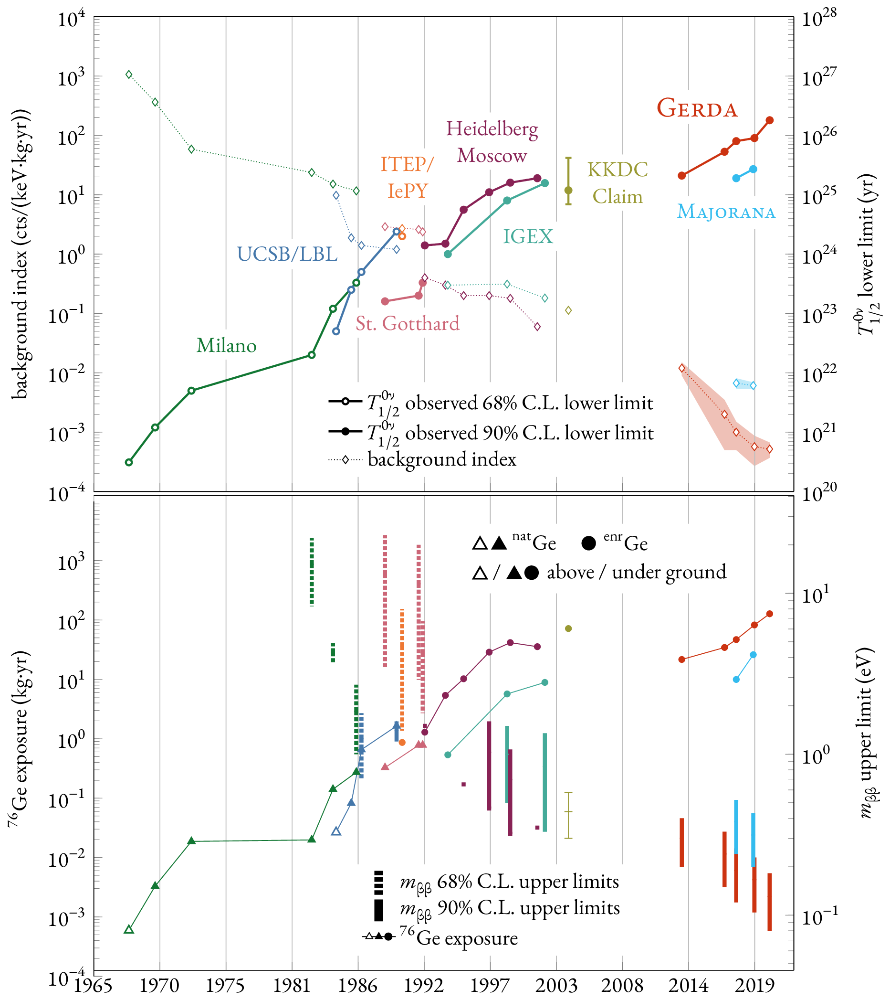

# 0vbb-ge76-history

Compilation of results of germanium experiments on neutrinoless double-beta
decay, as published in the scientific literature.

The data is publicly available in JSON format in
[`data/0vbb-ge76-history.json`](https://github.com/gipert/0vbb-ge76-history/tree/main/data/0vbb-ge76-history.json).

